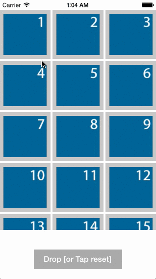

# UICollectionViewDragAndDropSelectedItems

UICollectionViewにて表示されるアイテムをDrag and Dropにて選択できるようにする習作。

## Demo

## 動作環境

iOS8〜

## 解説

* 各cellにUILongPressGestureRecognizerとtagを設定

	- 長押しでLongPressGestureのイベント発生、handlerメソッドがコールされる

* Pressされたcellのtagを取得し、そこから対象のcellを特定

	- CollectionViewのDelegateメソッドとは異なり、handlerにindexPathは渡ってこない

* UIGestureRecognizerStateBeganにてドラッグ用のUIImageViewを新規作成し、Pressされた座標を使いaddSubview。
また、imageデータを新しいImageViewに入れ、元をhidden=YES
　
	- ドラッグ用UIImageViewに影を付けるなどするとわかりやすくなる

* UIGestureRecognizerStateChangedにて座標の更新

	- 当たり判定など必要であればここで

* UIGestureRecognizerStateEndedにてドラッグ用のUIImageViewを削除したり、元をhidden=NOにするなど後始末を行う

	- データの更新、CollectionViewの更新なども

## ライセンス

MITライセンス

## 開発者

[@keygx] (<https://twitter.com/keygx>)
